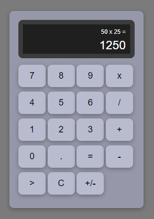

# Calculadora JavaScript

Este projeto é uma implementação simples de uma calculadora utilizando JavaScript, HTML e CSS. A classe `Calculator` foi criada para controlar as operações, entradas e a interface da calculadora de forma interativa.

### Principais Funções:

- **clearScreen()**: Limpa a tela e reseta a operação.
- **deleteLastValue()**: Apaga o último valor digitado.
- **writeOnScreen(value_text)**: Exibe um valor na tela de operação.
- **writeOperationOnScreen()**: Exibe a operação atual em andamento.
- **invertValue()**: Inverte o sinal do valor atual na tela.
- **realizeCalc(parcel_one, parcel_two, operator)**: Realiza uma operação matemática entre dois valores numéricos.
- **operationGetResult()**: Finaliza a operação e exibe o resultado.
- **operationGetOperator(operator)**: Inicia uma nova operação com o operador fornecido.

### Como usar:

1. **Inserir números**: Clique nos botões numéricos para inserir valores.
2. **Operações**: Selecione um operador para iniciar a operação entre dois números.
3. **Resultado**: Clique no botão de resultado para obter o cálculo final.
4. **Limpar**: Use o botão "Clear" para limpar a tela e reiniciar a calculadora.
5. **Excluir**: O botão "Delete" apaga o último número inserido.
6. **Inverter sinal**: Use o botão "Invert" para alterar o sinal do número na tela.

Este projeto oferece uma experiência de calculadora funcional, interativa e visualmente adaptável, ideal para ser utilizado como base para aprender a manipulação de DOM e eventos no JavaScript.

### Tecnologias Utilizadas:

- **JavaScript** (para a lógica da calculadora)
- **HTML** (estrutura da página e elementos de interface)
- **CSS** (estilização da interface)

### Exemplo

